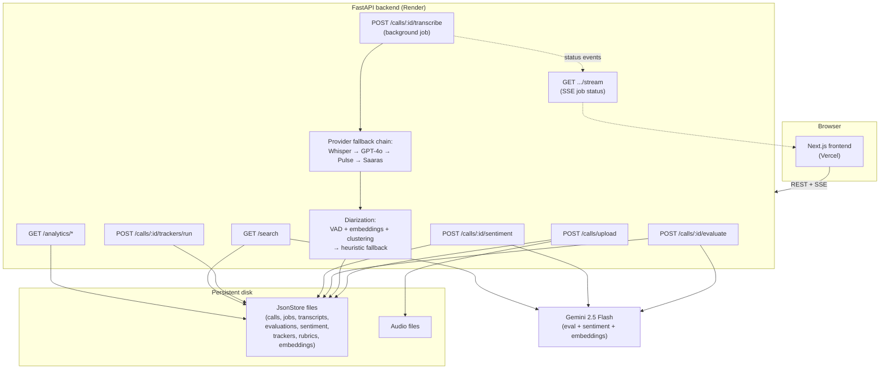

# CallSense AI

An asynchronous call-intelligence platform: upload a call recording, transcribe it through a
provider-independent fallback chain, diarize speakers with a real VAD + speaker-embedding pipeline,
score it against a configurable QA/compliance rubric with an LLM, analyze sentiment and keyword
trackers, embed it for semantic search, and view everything on a dashboard.

This is a personal/portfolio rebuild of the architecture pattern behind an enterprise call-intelligence
system — reimplemented from scratch, seeded with a public dataset. No employer code, prompts, or data
are used.

## Stack

- **Backend**: FastAPI, Python 3.12
- **Frontend**: Next.js (App Router), TypeScript, Tailwind CSS
- **Storage**: local JSON files + local filesystem for audio (no database — see rationale below)
- **Transcription providers**: OpenAI Whisper, OpenAI GPT-4o Transcribe, Smallest.ai Pulse, Sarvam Saaras v3
  — provider-independent interface with retry/fallback chain, gracefully skips unconfigured providers
- **Diarization**: `webrtcvad` (turn-boundary detection) + `resemblyzer` (CPU-only speaker embeddings) +
  `scikit-learn` agglomerative clustering, aligned onto transcript sentences; falls back to a
  sentence-alternating heuristic if audio-based diarization isn't possible (e.g. mono-speaker audio)
- **Evaluation**: Gemini 2.5 Flash scoring transcripts against a configurable, CRUD-managed rubric
- **Sentiment**: one batched Gemini call per transcript, scoring every segment in a single structured
  request (manually triggered, not automatic)
- **Trackers**: keyword-based topic detection (competitor mentions, pricing, cancellation, escalation,
  refund) over transcript segments
- **Semantic search**: Gemini embeddings + hand-rolled cosine similarity over a flat vector store
- **Real-time updates**: Server-Sent Events for transcription job status (no polling)
- **Auth**: optional shared-secret key via `?key=` shareable link, off by default
- **Tests**: pytest (backend, 60+ tests) and Vitest + React Testing Library (frontend, 19 tests)

## Project layout

```
backend/    FastAPI app — ingestion, transcription, diarization, evaluation, sentiment,
            trackers, rubrics, search, analytics
frontend/   Next.js dashboard — upload, call list/search, call detail, rubric editor,
            semantic search, KPI/trend dashboard
```

## Architecture



## Running locally

### Backend

Requires **Python 3.12** specifically (the diarization dependency `webrtcvad-wheels`
only ships prebuilt Windows wheels through 3.12/3.13; check with `py -3.12 --version`).

```bash
cd backend
./scripts/install.ps1   # Windows PowerShell — or ./scripts/install.sh on macOS/Linux
cp .env.example .env    # fill in whichever provider keys you have
./venv/Scripts/python -m uvicorn app.main:app --reload --port 8000
```

The install script exists because `resemblyzer` (used for speaker-embedding
diarization) depends on plain `webrtcvad`, which fails to build on Windows
without MSVC Build Tools — the script installs `webrtcvad-wheels` (a
prebuilt-wheel drop-in) first, then `resemblyzer` with `--no-deps` to avoid
pip re-triggering the broken build. Running `pip install -r requirements.txt`
directly will fail on a fresh environment; use the install script instead.

### Frontend

```bash
cd frontend
npm install
npm run dev
```

Frontend expects the backend at `http://localhost:8000` by default (see `frontend/.env.local`,
`NEXT_PUBLIC_API_BASE_URL`).

### Running tests

```bash
# Backend (from backend/, with venv active)
pip install -r requirements-dev.txt
pytest

# Frontend
cd frontend
npm run test
```

### Docker

```bash
docker compose up --build
```

Runs both services with persistent volumes for `backend/data` and `backend/storage` (survives
container restarts). Backend on `:8000`, frontend on `:3000`. Provider API keys are read from
`backend/.env` via `env_file` in `docker-compose.yml` — copy `.env.example` to `.env` first.

## Deploying

**Frontend → Vercel.** Trivial — connect the repo, set `NEXT_PUBLIC_API_BASE_URL` to your deployed
backend URL as an environment variable. The frontend is fully stateless.

**Backend → Render** (or any host with a persistent disk — Fly.io with a volume works the same way).
The backend is **not** deployable to Vercel/serverless functions or a free-tier PaaS without a
persistent disk: `JsonStore` writes flat JSON files and uploaded audio to local disk, and that state
needs to survive redeploys/restarts.

- `backend/render.yaml` declares a 1GB persistent disk mounted at `/var/data/callsense`, with
  `DATA_DIR`/`STORAGE_DIR` env vars pointing the app at it (both are read automatically by
  `pydantic-settings` — no code changes needed to relocate them).
- Render's free tier does **not** include a persistent disk (~$1-7/mo for a small one on a paid plan).
- Set `FRONTEND_ORIGINS` to your Vercel URL after the first deploy (CORS), and `API_KEY` if you want
  the shareable-link auth gate enabled (see below) — both are placeholders in `render.yaml`.

**Shareable demo link.** If `API_KEY` is set, the whole API requires it (`X-API-Key` header, or a
`key` query param for the SSE endpoint). Send an interviewer `https://your-frontend.vercel.app?key=<API_KEY>`
— the frontend saves it to `localStorage` on first visit and attaches it to every request after that.
Leave `API_KEY` unset for a fully open demo.

## Seeding demo data

`backend/scripts/seed_demo_data.py` seeds calls from the Kaggle
[Call Center Transcripts Dataset](https://www.kaggle.com/datasets/oleksiymaliovanyy/call-center-transcripts-dataset)
(MIT licensed) — download it into `../data_raw` first, then run the script. `evaluate_seeded_calls.py`
runs evaluation over any seeded calls that don't have one yet (requires `GEMINI_API_KEY`).
`scripts/backfill_durations.py` populates `duration_seconds` for calls uploaded before that feature
existed.

## Design decisions

**Why flat JSON files, not Postgres?** This runs at portfolio scale — dozens to low hundreds of
calls, a single user, no concurrent-write contention beyond `JsonStore`'s in-process lock. A real
database buys nothing at this scale except operational overhead: a schema to migrate, a connection
pool to configure, a service to keep running. `JsonStore` (`backend/app/storage/json_store.py`) is a
whole-file read/rewrite per operation behind a single `threading.Lock` — correct for one process,
trivially inspectable (every store is a `.json` file you can just open), and zero setup for anyone
cloning the repo. It would be the wrong choice at real multi-user scale; it's the right one here.

**Why a provider fallback chain for transcription, not one API?** No single transcription provider is
reliably available for a demo — API keys expire, free tiers run out, providers have outages. The
fallback chain (`backend/app/providers/router.py`) tries OpenAI Whisper → GPT-4o Transcribe →
Smallest Pulse → Sarvam Saaras in order, skipping any provider with no key configured and recording
every attempt on the `Job`. The practical effect: the app runs correctly with *zero* provider keys
set (transcription jobs fail gracefully with a clear reason), and adding just one key makes the whole
pipeline work — same resilience pattern a production system needs for provider outages, at portfolio
scale.

## Notes

- All 4 transcription providers require their own paid API key (each offers free signup credits) —
  the fallback router skips any provider with no key configured, so the app runs fine with zero keys set.
- `GEMINI_API_KEY` now powers three features: evaluation, sentiment analysis, and semantic search
  embeddings — all three degrade gracefully (503, not a crash) if it's unset.
- Auth is optional and off by default (`API_KEY` unset) — a single-user local tool by default, with
  an opt-in shareable-link key gate for public demo deploys (see Deploying above).
